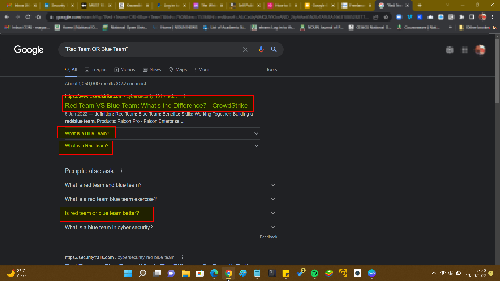

# 😁 SEARCH GGOOGLE LIKE A PRO

Since almost everything is online, free and available. _<mark style="color:blue;">**G**</mark><mark style="color:red;">**o**</mark><mark style="color:yellow;">**o**</mark><mark style="color:blue;">**g**</mark><mark style="color:green;">**l**</mark><mark style="color:red;">**e**</mark>_ is one of the main ways people search for information. it has a user-friendly interface where you will just type in your questions directly into the search bar and hit Enter on your keyboard or Search the search icon.

<figure><figcaption>
GOOGLE SEARCH HOMEPAGE
</figcaption></figure>

And while you might think it's obvious, many internet users don't know how to use Google search **efficiently** and **effectively**.&#x20;


truth is, _<mark style="color:blue;">**G**</mark><mark style="color:red;">**o**</mark><mark style="color:yellow;">**o**</mark><mark style="color:blue;">**g**</mark><mark style="color:green;">**l**</mark><mark style="color:red;">**e'**</mark><mark style="color:blue;">**ing is an Art.**</mark>_


> &#x20;_<mark style="color:purple;">if you want to get the right answers, you need to ask the right questions. And to get the right answers quickly, you must know</mark> <mark style="color:purple;"></mark><mark style="color:purple;">**how**</mark> <mark style="color:purple;"></mark><mark style="color:purple;">to ask the right questions.</mark>_

Everyone should learn how to search with _<mark style="color:blue;">**G**</mark><mark style="color:red;">**o**</mark><mark style="color:yellow;">**o**</mark><mark style="color:blue;">**g**</mark><mark style="color:green;">**l**</mark><mark style="color:red;">**e**</mark>_ and that's what this tutorial is all about. Below are some helpful tips and tricks you can use to find correct answers to your questions fast, effectively and efficiently.

#### 10 Tips to Search Google Like a Pro

1. Use quotes to get an <mark style="color:green;">"EXACT"</mark> match
2. Search within a specific site with <mark style="color:green;">****</mark>** **<mark style="color:green;background-color:blue;">**site:**</mark>
3. Exclude a term from search results with <mark style="color:green;background-color:blue;">**-**</mark>
4. Search images of a particular size with <mark style="color:green;background-color:blue;">**imagesize:**</mark>
5. Search for a particular filetype with <mark style="color:green;background-color:blue;">**filetype:**</mark>
6. Use wildcard <mark style="color:green;background-color:blue;">**\***</mark> to make searches
7. Combine searches with <mark style="color:green;background-color:blue;">**OR, AND**</mark> logic
8. Filter out searches with <mark style="color:green;background-color:blue;">**AFTER:, BEFORE: or ..**</mark> between two numbers
9. Check out related websites using <mark style="color:green;background-color:blue;">**related:**</mark>
10. Use <mark style="color:green;background-color:blue;">**cache:**</mark> to see _<mark style="color:blue;">**G**</mark><mark style="color:red;">**o**</mark><mark style="color:yellow;">**o**</mark><mark style="color:blue;">**g**</mark><mark style="color:green;">**l**</mark><mark style="color:red;">**e**</mark>_'s cached version of a website


_LET'S BREAK IT DOWN REAL QUICK_


#### 1. Use quotes to get an <mark style="color:green;"><mark style="background-color:blue;">"EXACT"<mark style="background-color:blue;"></mark> Match

Generally, when we do a normal search _<mark style="color:blue;">**G**</mark><mark style="color:red;">**o**</mark><mark style="color:yellow;">**o**</mark><mark style="color:blue;">**g**</mark><mark style="color:green;">**l**</mark><mark style="color:red;">**e**</mark>_ don't search deeply or it won't give us the exact result we are looking for, it will just do a shallow search and display the result it can find, but if you wrap your search with the double quotation like shown below

&#x20;<mark style="color:green;background-color:blue;">**"Your question goes here "**</mark>**  **&#x20;

_<mark style="color:blue;">**G**</mark><mark style="color:red;">**o**</mark><mark style="color:yellow;">**o**</mark><mark style="color:blue;">**g**</mark><mark style="color:green;">**l**</mark><mark style="color:red;">**e**</mark>_ will do a deep search and get you the exact answer you're looking for with all the keyword in your search term.&#x20;

This is helpful when you absolutely want a particular term or phrase to be there in your search results.


_<mark style="background-color:blue;">**Let's see the search result**</mark>_&#x20;

_<mark style="background-color:blue;">**"What is 'IP Address' in Networking".**</mark>_


<figure><figcaption>
Exact Match Result 
</figcaption></figure>

**2. Search within a specific site with **<mark style="color:green;">****</mark>** **<mark style="color:green;background-color:blue;">**site:**</mark>

The <mark style="color:green;">****</mark>** **<mark style="color:green;background-color:blue;">**site:**</mark>** Tag** is use to search within a specific website, If you want _<mark style="color:blue;">**G**</mark><mark style="color:red;">**o**</mark><mark style="color:yellow;">**o**</mark><mark style="color:blue;">**g**</mark><mark style="color:green;">**l**</mark><mark style="color:red;">**e**</mark>_ to return results from within a particular website, just add <mark style="color:green;">****</mark>** **<mark style="color:green;background-color:blue;">**site:**</mark> before the question you are searching.

This is also helpful when you want to search for something within a website that doesn't have an internal search option or perhaps doesn't have a very effective one


_<mark style="background-color:blue;">**Let's see the search result**</mark>_&#x20;

_<mark style="background-color:blue;">**site:cisco.com Networking.**</mark>_


<figure><figcaption>
site: showing Result only from cisco.com
</figcaption></figure>

****

**3. Exclude a term from search results with **<mark style="color:green;background-color:blue;">**-**</mark>

If you don't want a term or phrase to appear in your search results, then just add <mark style="color:green;background-color:blue;">**-**</mark> in front of that word then _<mark style="color:blue;">**G**</mark><mark style="color:red;">**o**</mark><mark style="color:yellow;">**o**</mark><mark style="color:blue;">**g**</mark><mark style="color:green;">**l**</mark><mark style="color:red;">**e**</mark>** **<mark style="background-color:blue;">****</mark>_ won't show it in your search result.


_<mark style="background-color:blue;">**Let's see the search result**</mark>_&#x20;

_<mark style="background-color:blue;">**"cisco.com Networking -hubs".**</mark>_


<figure><figcaption>
the -hubs means search for networking devices but exclude the term<a href="https://www.techtarget.com/searchnetworking/definition/hub"> hubs</a>
</figcaption></figure>

#### **4. Search images of a particular size with **<mark style="color:green;background-color:blue;">**imagesize:**</mark>

If you want to search images of a particular size, then use the tag <mark style="color:green;background-color:blue;">**imagesize:**</mark> in your search query along with the width and height in **pixels **_<mark style="color:blue;">**G**</mark><mark style="color:red;">**o**</mark><mark style="color:yellow;">**o**</mark><mark style="color:blue;">**g**</mark><mark style="color:green;">**l**</mark><mark style="color:red;">**e**</mark> will display the right result for you_.


_**Dimension should be in Pixels only!**_


if you use <mark style="color:green;background-color:blue;">**imagesize:500x600**</mark> the result of this search will display image results which have a dimension of **500px x 600px.**


_<mark style="background-color:blue;">**Let's see the search result**</mark>_&#x20;

_<mark style="background-color:blue;">**"Cute cat images imagesize:500x600".**</mark>_


<figure><figcaption>
<em><strong>imagesize:</strong> showing result of cat images that are 500px X 600px</em>
</figcaption></figure>

#### **5. Search for a particular filetype with **<mark style="color:green;background-color:blue;">**filetype:**</mark>

If you want _<mark style="color:blue;">**G**</mark><mark style="color:red;">**o**</mark><mark style="color:yellow;">**o**</mark><mark style="color:blue;">**g**</mark><mark style="color:green;">**l**</mark><mark style="color:red;">**e**</mark>_ to get you search results that contain a particular file type such as PDF, docs, Apk, exe, dmg, PPT, then add <mark style="color:green;background-color:blue;">**filetype:extension**</mark>


_<mark style="background-color:blue;">**Let's see the search result**</mark>_

_<mark style="background-color:blue;">**"Network cables Filetype:PDF"**</mark>_


<figure><figcaption>
Displaying result for PDF files
</figcaption></figure>

#### 6. Use wildcard <mark style="color:green;background-color:blue;">\*</mark> to make searches

If you are unsure about or you have forgotten any term in your search query/ question, relax _<mark style="color:blue;">**G**</mark><mark style="color:red;">**o**</mark><mark style="color:yellow;">**o**</mark><mark style="color:blue;">**g**</mark><mark style="color:green;">**l**</mark><mark style="color:red;">**e**</mark> got you just u_se the wildcard <mark style="color:green;background-color:blue;">\*</mark> character. _<mark style="color:blue;">**G**</mark><mark style="color:red;">**o**</mark><mark style="color:yellow;">**o**</mark><mark style="color:blue;">**g**</mark><mark style="color:green;">**l**</mark><mark style="color:red;">**e**</mark>_ will replace it for you with relevant terms.


_<mark style="background-color:blue;">**Let's see the result of the search**</mark>_&#x20;

_<mark style="background-color:blue;">**"The \* of Computer Networking"**</mark>_


<figure><figcaption>
The search returns bunch of results about Networking, types etc.
</figcaption></figure>

#### 7. Combine searches with <mark style="background-color:blue;"><mark style="color:green;">OR, AND logic<mark style="color:green;"></mark>

If you want your _<mark style="color:blue;">**G**</mark><mark style="color:red;">**o**</mark><mark style="color:yellow;">**o**</mark><mark style="color:blue;">**g**</mark><mark style="color:green;">**l**</mark><mark style="color:red;">**e**</mark>_ search results to contain two terms, then put the <mark style="background-color:blue;"><mark style="color:green;">**AND**<mark style="color:green;"></mark> <mark style="background-color:blue;"><mark style="color:green;"> </mark><mark style="background-color:blue;"><mark style="color:green;"><mark style="color:green;"></mark> keyword in between them.

Similarly, if you want either of the terms in your search results, then use the <mark style="background-color:blue;"><mark style="color:green;">**OR**<mark style="color:green;"></mark> keyword in between them


_<mark style="background-color:blue;">**Let's see the result of the search**</mark>_&#x20;

_<mark style="background-color:blue;">**"Red Team AND Blue Team"**</mark>_

_<mark style="background-color:blue;">**"Red Team OR Blue Team"**</mark>_


<figure><figcaption>
The <strong>AND</strong> Result
</figcaption></figure>

 

<figure><figcaption>
The <strong>OR</strong> Result
</figcaption></figure>

#### _**8.**_ Filter out searches with <mark style="background-color:blue;"><mark style="color:green;">**AFTER:**<mark style="color:green;"></mark>, <mark style="background-color:blue;"><mark style="color:green;">BEFORE:<mark style="color:green;"></mark> or <mark style="background-color:blue;"><mark style="color:green;">..<mark style="color:green;"></mark> between two numbers

If you want _<mark style="color:blue;">**G**</mark><mark style="color:red;">**o**</mark><mark style="color:yellow;">**o**</mark><mark style="color:blue;">**g**</mark><mark style="color:green;">**l**</mark><mark style="color:red;">**e**</mark>_ to display search results that were published after a particular year, then use the tag <mark style="background-color:blue;"><mark style="color:green;">**AFTER:**<mark style="color:green;"></mark>,&#x20;

while adding the tag, <mark style="background-color:blue;"><mark style="color:green;">**BEFORE**<mark style="color:green;"></mark><mark style="background-color:blue;"><mark style="color:green;">:<mark style="color:green;"></mark> will return results published before a particular year.

if you also want to search for results that are published in a certain year range, or for that matter between any numbers. Just add <mark style="background-color:blue;"><mark style="color:green;">..<mark style="color:green;"></mark> between the two numbers you want to search in between along with the units, if any.


_<mark style="background-color:blue;">**Let's see the result of the search**</mark>_&#x20;

_<mark style="background-color:blue;">**"Networking tutorials BEFORE:2020"**</mark>_

_<mark style="background-color:blue;">**"Networking tutorials AFTER:2020"**</mark>_


<figure><figcaption>
showing Result BEFORE:2020 
</figcaption></figure>

 

<figure><figcaption>
showing Result for AFTER:2020
</figcaption></figure>

#### 9. Check out related websites using <mark style="background-color:blue;"><mark style="color:green;">**related:**<mark style="color:green;"></mark>

If you want _<mark style="color:blue;">**G**</mark><mark style="color:red;">**o**</mark><mark style="color:yellow;">**o**</mark><mark style="color:blue;">**g**</mark><mark style="color:green;">**l**</mark><mark style="color:red;">**e**</mark>_ to search for the websites that are on the internet similar to a particular website, then use the <mark style="background-color:blue;"><mark style="color:green;">**related:**<mark style="color:green;"></mark> tag.


_<mark style="background-color:blue;">**Let's see the result of the search**</mark>_&#x20;

_<mark style="background-color:blue;">**"**</mark>_<mark style="background-color:blue;">**related:google.com**</mark>_<mark style="background-color:blue;">**"**</mark>_

_<mark style="background-color:blue;">****</mark>_


<figure><figcaption>
The <strong>Related:</strong> tag returns all the websites that are related to google.com
</figcaption></figure>

#### 10. Use <mark style="background-color:blue;"><mark style="color:green;">**cache:**<mark style="color:green;"></mark> to see _<mark style="color:blue;">**G**</mark><mark style="color:red;">**o**</mark><mark style="color:yellow;">**o**</mark><mark style="color:blue;">**g**</mark><mark style="color:green;">**l**</mark><mark style="color:red;">**e**</mark>_'s cached version of a website

_<mark style="color:blue;">**G**</mark><mark style="color:red;">**o**</mark><mark style="color:yellow;">**o**</mark><mark style="color:blue;">**g**</mark><mark style="color:green;">**l**</mark><mark style="color:red;">**e**</mark>_ stores a cached version of websites to provide search results quickly. To see if _<mark style="color:blue;">**G**</mark><mark style="color:red;">**o**</mark><mark style="color:yellow;">**o**</mark><mark style="color:blue;">**g**</mark><mark style="color:green;">**l**</mark><mark style="color:red;">**e**</mark>_ has cached any site or not, just use the tag <mark style="background-color:blue;"><mark style="color:green;">**cache:**<mark style="color:green;"></mark>  in front of the website's URL.


_<mark style="background-color:blue;">**Let's see the result of the cache of my medium blog**</mark>_&#x20;

_<mark style="background-color:blue;">**"**</mark>_<mark style="background-color:blue;">cache:https://almustarphar.medium.com</mark>_<mark style="background-color:blue;">**"**</mark>_


<figure><figcaption>
As you see, even though I am searching for the site on 14th August 2022, I still see a copy of the site from 13th August 2022, as that is when Google has cached the website. It is important to note that <strong> </strong><em><strong>"Not all search operators return exhaustive results." as mentioned by</strong></em> <a href="https://support.google.com/websearch/answer/2466433?visit_id=637790664879774647-1036329470&#x26;p=adv_pages_similar&#x26;hl=en&#x26;rd=1"><em><strong>Google</strong></em></a> <em><strong>itself"</strong></em>
</figcaption></figure>

That's all for now, I've explained them to the best of my knowledge and  i hope i have encouraged you to use them in your regular Google search for better, fast and efficient results.

### Let's Wrap it Up Guys!

Thanks for reading! I really hope you enjoyed reading this short article about how to _<mark style="color:blue;">**G**</mark><mark style="color:red;">**o**</mark><mark style="color:yellow;">**o**</mark><mark style="color:blue;">**g**</mark><mark style="color:green;">**l**</mark><mark style="color:red;">**e like a Pro**</mark>_.

Hope you will use the tips on the tutorials to step up your search techniques.

Do consider sharing it with your friends – I'd really appreciate that.

&#x20;Follow me on [LinkedIn](https://linkedin.com/in/muhammad-almustafa) and [Twitter](https://twitter.com/GM\_Almustafa) and stay tuned for more amazing content! Peace out! 🖖

